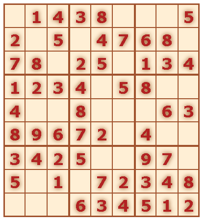

# Sudoku

Love playing sudoku.    
This is sudoku field generator based on [backtracking](https://en.wikipedia.org/wiki/Backtracking "Backtracking algorithm") algorithm.    Difficulty level can be changed.    
The field is not interactive, but actual game features can be implemented. I made it just to generate and print.    
Did minimum design. Mostly was interested in algorithm itself.    

### Algorithm   
I've built it around __cells IDs__. Script generate cells with ID of 3 numbers:
- first - row number (0 to 8) - starts with 0 to iterate easier later
- seconf - box number (1 to 9) - top to bottom, left to right 9 boxes of 3x3 numbers
- third - column number (0 to 8) - starts with 0 to iterate easier later       

Underline at the end to avoid cells autosorting by number.    
       
This serves __two purposes__:
- search cell rows, column and boxes for repeated numbers (in sudoku numbers must be uniques in each box, row and column)
- for CSS styles. I'm using start and end of ID selectors (`[id^="8"], [id$="3_"]`) to draw lines between boxes of numbers.    
      
First row of numbers generated randomly by shuffling set of 9 unique numbers. This allows to get different gamefield each time.    
Then entire game field is filled with numbers. After this certain number of cells (according to game difficulty) is removed.     
        
This is end result:     
     
     

### Test it yourself
Live version can be found [here](http://artem-soroka.tk/pages/sudoku/ "Sudoku generator").   
     
Thank you.